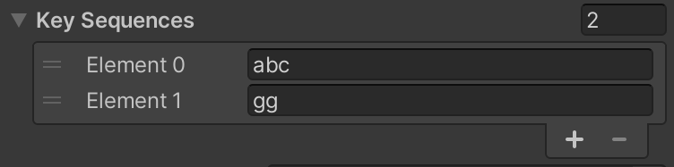

# KeySequences README

Fire events on particular key sequences.

## Motivation

Key sequences have many uses: they can be used as cheat codes for a game at runtime, and they can be used as a minimalist UI during game development. 

Hot keys often fulfill this need. Hot keys are bound to one key and some modifiers, e.g., `ctrl-t`. In their favor, hot keys are easy to implement. Given four modifier keys like shift, control, alt, and a system key, there are 16 distinct combinations per regular key. But despite the raw combinations available, hot keys can be cumbersome. There are only so many keys not already bound for something else within the Unity Editor. Sometimes particular modifiers are used by the OS in frustrating ways. And it's hard to build up any mnemonics with hot keys since each key combination must be different.

| Hot Key | Effect         |
|---------|----------------|
| shift-e | Spawn enemy    |
| shift-c | Spawn chest    |
| shift-p | Respawn player |
| ctrl-o  | Door Open      |
| ctrl-c  | Door Close     |
| ctrl-l  | Door Lock      |

Key sequences alleviate some of these issues by allowing mnemonics to group operations and by not requiring modifiers. However, while key sequences are relatively simple, the implementation requires state, updates, and matching, which is often enough pain to drive one to find some hotkey that is not in use yet. That's where this library comes in to remove the implementation burden.

| Key Sequence | Effect         |
|--------------|----------------|
| se           | Spawn enemy    |
| sc           | Spawn chest    |
| sp           | Respawn player |
| do           | Door open      |
| dc           | Door close     |
| dl           | Door lock      |

## Requirements

* Unity 2019.4 or later

## Installation

Open the Package Manager window in Unity. Click the plus drop down menu and select from git URL. Copy and paste the following URL:

```
https://github.com/shanecelis/KeySequences.git
```

## Usage

Here's an example of using KeySequencer setup purely with code.

``` c#
var keySequences = new KeySequencer();
keySequences.Add("gg");
keySequences.accept += keys => Debug.Log($"Got {keys}.");
keySequences.Enable();
keySequences.OnTextInput('g');
keySequences.OnTextInput('g'); // Logs "Got gg."
```

### On a MonoBehaviour

KeySequencer is designed to fit in with Unity's new InputSystem. To use with a MonoBehaviour, add a KeySequencer field.

``` c#
[SerializeField] private KeySequencer keySequences;
```

Setup the key sequences in the inspector.



Enable and setup the handling in code.

``` c#
keySequences.accept += keys => Debug.Log($"Got {keys}.");
keySequences.Enable();
```

Finally, one has to setup the input to the KeySequencer. One can do this with the new InputSystem or the legacy InputManager.

#### Using InputSystem

``` c#
Keyboard.current.onTextInput += keySequences.OnTextInput;
```

#### Using Legacy InputManager

``` c#
void Update() {
  foreach (char c in Input.inputString)
    keySequences.OnTextInput(c);
}
```

## Design Notes

The input stream consists of unadorned `char`s. The key sequences are simply strings of those `char`s. 

### Why just chars and strings?

We could have chosen to add spaces between the characters, e.g., instead of "se" to spawn enemy, why not "s e"? That would eliminate space as a key sequence character and introduce complexity, and space is actually a pretty excellent leader key. People have made whole application's center around them like [Spacemacs](https://www.spacemacs.org/).

I say treat the way KeySequencer's specifies key sequences as low-level. I prefer "s e" in documentation for the user and suggest using whatever notation you find most readable.

Or we could have used some kind of mini-language or notation to describe the modifiers and keys the way other apps do, e.g., `C-x C-s` to save in [Emacs](https://emacsrocks.com), or `alt-x` to execute an extended command as my own [Minibuffer Console](http://seawisphunter.com/products/minibuffer/) does. In KeySequencer's case, `C-x C-s` or `control-x control-s` is `new string(new char[] { 24, 19 })` and those are non-printing characters; and `alt-x` is "≈" or 8776 on my computer.

So there are certainly limitations but that's one of the costs of keeping something light-weight. And if one really wanted to add a nice notation, I don't see how that ought to change anything KeySequencer does at runtime.

## FAQ

### How do I find the right char for non-printing characters?

See the samples. They each print the input character and its integer value.

## TODO

- Add KeySequenceDrawer class a way to record a key sequence similar to [InputAction](https://docs.unity3d.com/Packages/com.unity.inputsystem@1.0/api/UnityEngine.InputSystem.InputAction.html)'s listen button.

## Acknowledgements

This package was originally generated from [Shane Celis](https://twitter.com/shanecelis)'s [unity-package-template](https://github.com/shanecelis/unity-package-template).
