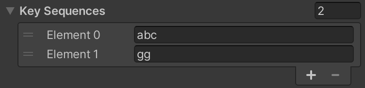

# KeySequences README

Fire events for particular key sequences efficiently.


## Motivation

Key sequences have many uses: they can be used as cheat codes for a game at runtime, and they can be used as a minimalist UI during game development. 

Hot keys often fulfill this need. Hot keys are bound to one key and some modifiers, e.g., `ctrl-t`. In their favor, hot keys are easy to implement. Given four modifier keys like shift, control, alt, and a system key, there are 16 distinct combinations per regular key. But despite the raw combinations available, hot keys can be cumbersome. There are only so many keys not already bound for something else within the Unity Editor. Sometimes particular modifiers are used by the OS in frustrating ways. And it's hard to build up any mnemonics with hot keys since each key combination must be different.

| Hot Key          | Effect          |
|------------------|-----------------|
| shift-e          | Spawn enemy     |
| shift-c          | Spawn chest     |
| alt-c            | Spawn creature  |
| shift-p          | Respawn player  |
| ctrl-o           | Door Open       |
| ctrl-c           | Door Close      |
| ctrl-l           | Door Lock       |
| alt-ctrl-shift-g | Enable god mode |

Key sequences alleviate some of these issues by allowing mnemonics to group operations and by not requiring modifiers. However, while key sequences are relatively simple, the implementation requires state, updates, and matching, which is often enough pain to drive one to find some hotkey that is not in use yet. That's where this library comes in to remove the implementation burden.

| Key Sequence | Effect          |
|--------------|-----------------|
| se           | Spawn enemy     |
| sc           | Spawn chest     |
| sC           | Spawn creature  |
| sp           | Respawn player  |
| do           | Door open       |
| dc           | Door close      |
| dl           | Door lock       |
| idqd         | Enable god mode |

KeySequencer also focuses on efficiency. It uses a [Trie](https://en.wikipedia.org/wiki/Trie) to detect whether the accumulated characters have any possible matches. If no key sequences are possible, the accumulated characters are discarded.

## Requirements

* Unity 2019.4 or later

## Installation

Open the Package Manager window in Unity. Click the plus drop down menu and select from git URL. Copy and paste the following URL:

```
https://github.com/shanecelis/KeySequences.git
```

## Usage

Here's an example of using KeySequencer setup purely with code.

``` c#
// Setup.
var keySequences = new KeySequencer();
keySequences.Add("abc");
keySequences.Add("gg");
keySequences.accept += keys => Debug.Log($"ACCEPT {keys}");
keySequences.Enable();

// Send input.
keySequences.Input('g');
keySequences.Input('g'); // Logs "ACCEPT gg"
```

### On a MonoBehaviour

KeySequencer is designed to fit in with Unity's new InputSystem but also works with the legacy InputManager. To use with a MonoBehaviour, add a KeySequencer field.

``` c#
[SerializeField] private KeySequencer keySequences;
```

Setup the key sequences in the inspector.



Enable and setup the handling in code.

``` c#
keySequences.accept += keys => Debug.Log($"ACCEPT {keys}");
keySequences.Enable();
```

KeySequencer is disabled by default like Unity's InputAction. And all the handling of its various key seqeuences is specified by the `accept` event.

Finally, one has to setup the input to the KeySequencer. One can do this with the new InputSystem or the legacy InputManager.

#### Using Legacy InputManager

Sample "0 Demo" demonstrates using the legacy InputManager.

``` c#
void Update() {
  foreach (char c in Input.inputString)
    keySequences.Input(c);
}
```

#### Using New InputSystem

Sample "1 Demo" demonstrates using the new InputSystem.

``` c#
Keyboard.current.onTextInput += keySequences.Input;
```


### Show Accumulated Input

Some applications will show accumulated inputs for key seqeuences which can help guide the user. KeySequencer implements a property changed event that can be used to do something similar with KeySequencer.


``` c#
keySequences.propertyChanged += (sender, args) => label.text = keySequences.accumulated;
```

Note: Non-printing characters in this case will be vexing.

## KeySequencerMap

KeySequencer only provides one argument when a key sequence is found, that is the key sequence itself. In principle this is sufficient for any acceptance action one likes. But as a convenience there is also a `KeySequencerMap<T>` class. It works roughly the same but it includes a value.

### Pure code

``` c#
// Setup.
var keySequences = new KeySequencerMap<int>();
keySequences.Add("abc", 100);
keySequences.Add("gg", 200);
keySequences.accept += (keys, value) => Debug.Log($"ACCEPT {keys} VALUE {value}");
keySequences.Enable();

// Send input.
keySequences.Input('g');
keySequences.Input('g'); // Logs "ACCEPT gg VALUE 200"
```

See sample "2 demo" which demonstrates how to setup a KeySequencerMap<int> that will work with Unity's inspector.


## Design Notes

The input stream consists of unadorned `char`s. The key sequences are simply strings of those `char`s. 

### Why just chars and strings?

We could have chosen to add spaces between the characters, e.g., instead of specifying "se" to spawn enemy, why not say "s e"? One reason not to is that would eliminate space as a key sequence character and introduce complexity, and space is actually a pretty excellent leader key. People have made whole application's center around them like [Spacemacs](https://www.spacemacs.org/).

I say treat the way KeySequencer specifies key sequences as low-level. I prefer "s e" in documentation for the user and suggest using whatever notation you find most readable.

Further we could have used some kind of mini-language or notation to describe the modifiers and keys the way other apps do, e.g., `C-x C-s` to save in [Emacs](https://emacsrocks.com), or `alt-x` to execute an extended command as my own [Minibuffer Console](http://seawisphunter.com/products/minibuffer/) does. In KeySequencer's case, `C-x C-s` or `control-x control-s` is `new string(new char[] { 24, 19 })` and those are non-printing characters; and `alt-x` is "≈" or 8776 on my computer, which is probably peculiar.

So there are certainly limitations but that's one of the costs of keeping something light-weight. And if one really wanted to add a nice notation, I don't see how that ought to change anything KeySequencer does at runtime.

## FAQ

### How do I find the right char for non-printing characters?

See the sample scenes. While running, the scene each print the input character and its integer value in the Console window.

## TODO

- Add to the KeySequenceDrawer class a way to record a key sequence similar to [InputAction](https://docs.unity3d.com/Packages/com.unity.inputsystem@0.9/manual/ActionAssets.html#picking-controls)'s listen button.

- Consider adding a global disable for use when [an input field is being used](https://forum.unity.com/threads/how-to-disable-movement-keys-when-typing-into-input-box.389942/#post-4333129).

- There is one string created from a string buffer each time an input is created to query against the trie. Is there a way to avoid that allocation? 

- Consider adding a timeout for accumulated key sequences. Or a means for the user to timeout it out themselves.

- Q: Is there a way of getting the hardware keys pressed rather than relying on the `char` produced?

## Acknowledgements

This package was originally generated from [Shane Celis](https://twitter.com/shanecelis)'s [unity-package-template](https://github.com/shanecelis/unity-package-template).
